# Such A Good Clock

[](https://nazmiefearmutcu.github.io/such-a-good-clock/)
[](https://github.com/nazmiefearmutcu/such-a-good-clock/releases)
[](LICENSE)
[](https://github.com/nazmiefearmutcu/such-a-good-clock/actions/workflows/desktop-build.yml)
[](https://github.com/nazmiefearmutcu/such-a-good-clock/stargazers)

**A clock you'd actually want fullscreen on a spare monitor.** Eleven cinematic themes, three clock faces (digital, analog, flip), alarms, countdown timers, a Pomodoro mode, a stopwatch with laps and CSV export, a multi-timezone world clock, ambient soundscapes, and full keyboard control. Runs as a browser PWA (offline-capable) or as a native macOS / Windows / Linux desktop app.

## Download

<p align="left">
  <a href="https://github.com/nazmiefearmutcu/such-a-good-clock/releases/latest/download/Such.A.Good.Clock-2.0.1-arm64.dmg">
    
  </a>
  &nbsp;
  <a href="https://github.com/nazmiefearmutcu/such-a-good-clock/releases/latest/download/Such.A.Good.Clock.Setup.2.0.1.exe">
    
  </a>
  &nbsp;
  <a href="https://nazmiefearmutcu.github.io/such-a-good-clock/">
    
  </a>
</p>

After dragging Such A Good Clock to your `/Applications` folder, the first
launch shows a one-time *"downloaded from the internet"* prompt — that's
macOS Gatekeeper. The app is unsigned (every byte of source is right here
on GitHub), so right-click → **Open** the first time to confirm. Subsequent
launches behave like any other app.

<details>
<summary>Linux + alternate downloads</summary>

| Platform | File |
| --- | --- |
| Linux AppImage | [`Such.A.Good.Clock-2.0.1.AppImage`](https://github.com/nazmiefearmutcu/such-a-good-clock/releases/latest/download/Such.A.Good.Clock-2.0.1.AppImage) |
| Linux Debian/Ubuntu | [`such-a-good-clock_2.0.1_amd64.deb`](https://github.com/nazmiefearmutcu/such-a-good-clock/releases/latest/download/such-a-good-clock_2.0.1_amd64.deb) |
| Linux tarball | [`such-a-good-clock-2.0.1.tar.gz`](https://github.com/nazmiefearmutcu/such-a-good-clock/releases/latest/download/such-a-good-clock-2.0.1.tar.gz) |
| Apple Silicon Mac (zip) | [`Such.A.Good.Clock-2.0.1-arm64-mac.zip`](https://github.com/nazmiefearmutcu/such-a-good-clock/releases/latest/download/Such.A.Good.Clock-2.0.1-arm64-mac.zip) |
| Windows portable | [`Such.A.Good.Clock.2.0.1.exe`](https://github.com/nazmiefearmutcu/such-a-good-clock/releases/latest/download/Such.A.Good.Clock.2.0.1.exe) |

Or browse [all releases](https://github.com/nazmiefearmutcu/such-a-good-clock/releases).

</details>

## Preview

> Live demo: **[nazmiefearmutcu.github.io/such-a-good-clock](https://nazmiefearmutcu.github.io/such-a-good-clock/)**

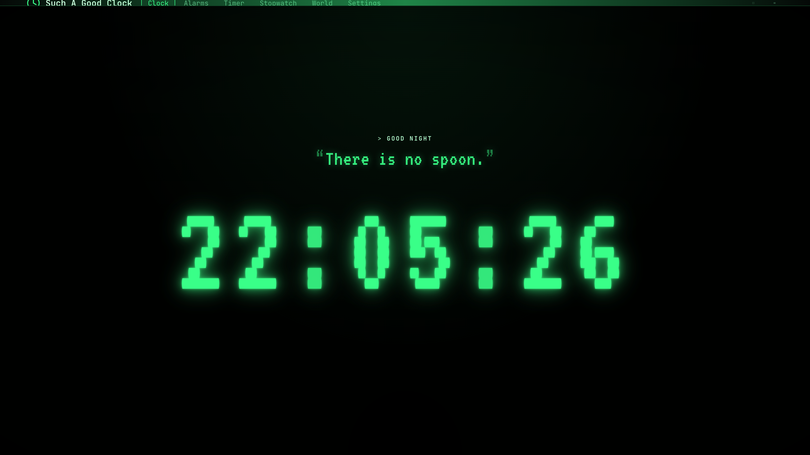

### Cinematic themes

#### Matrix


#### 2049 (Blade Runner)
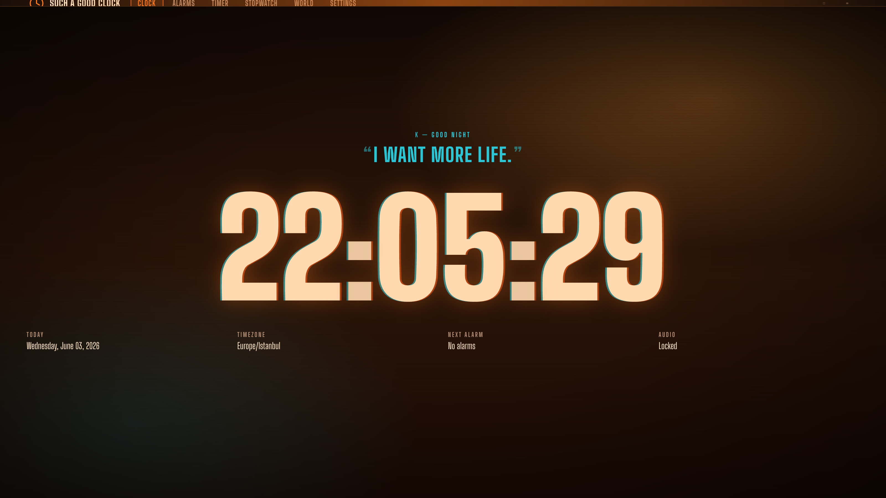

#### Interstellar
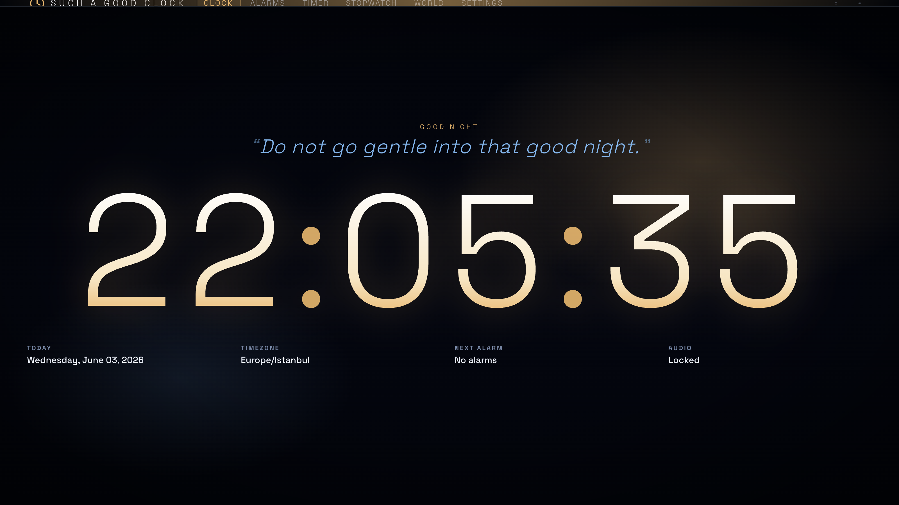

#### Cyberpunk
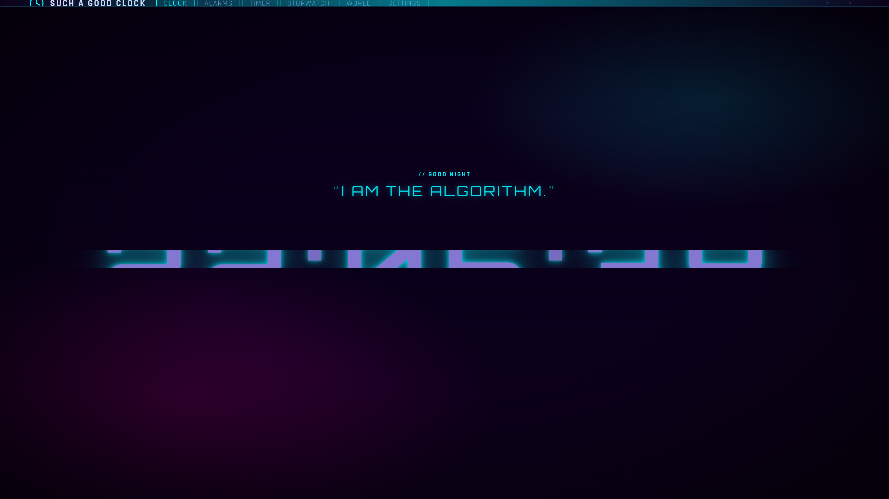

#### Synthwave
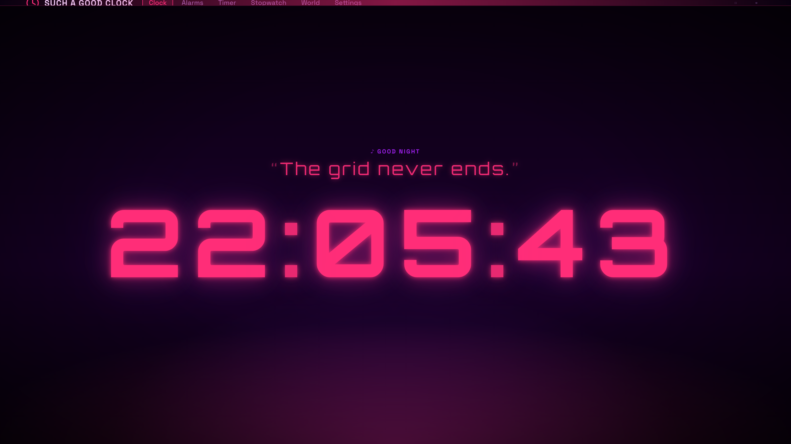

#### Dune
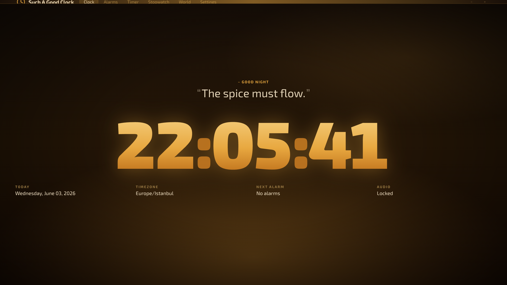

#### Mandalorian
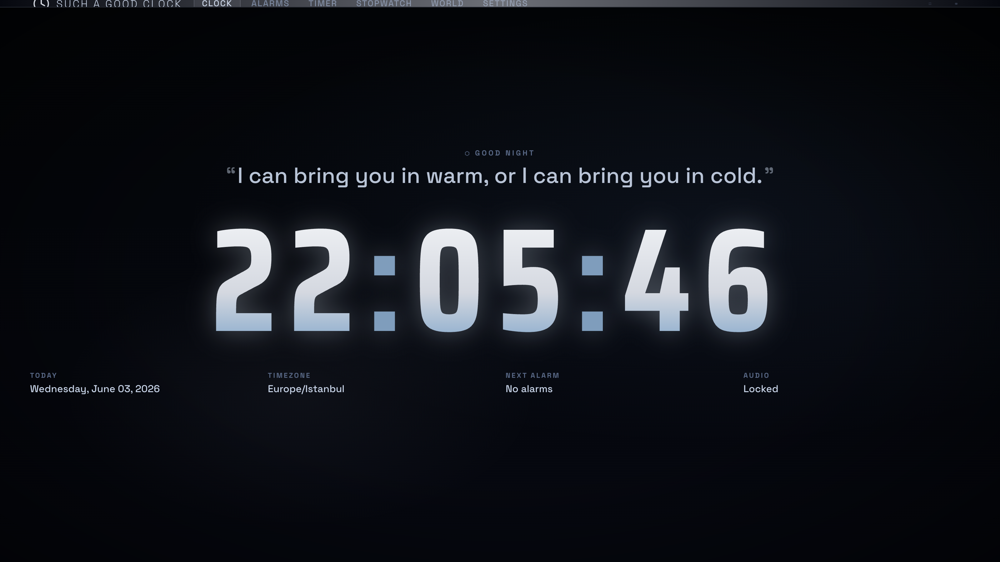

#### Trinity (Oppenheimer)
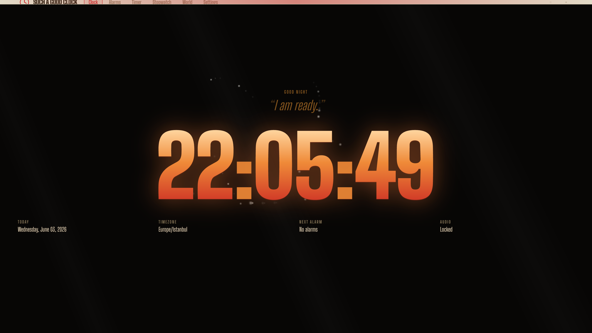

#### Alien (Nostromo amber CRT)
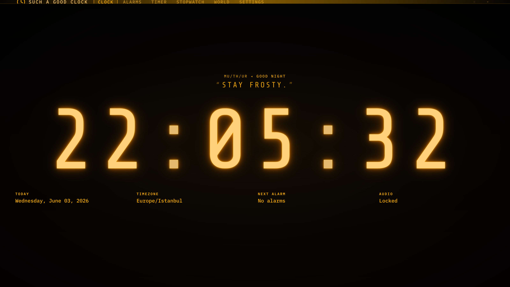

#### Pinkie
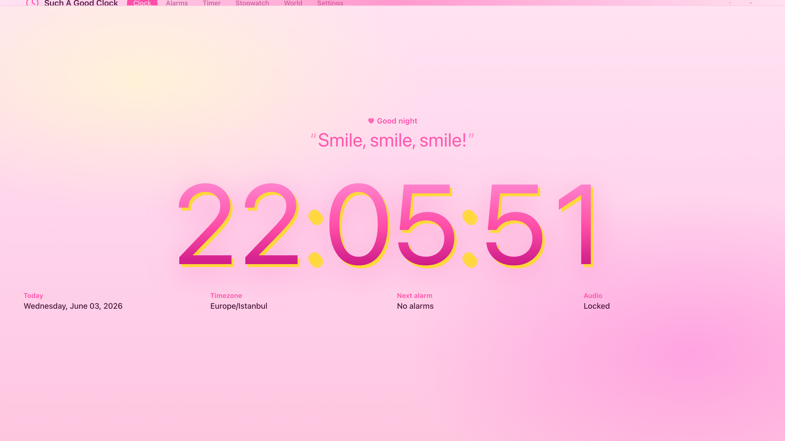

#### Rainbow
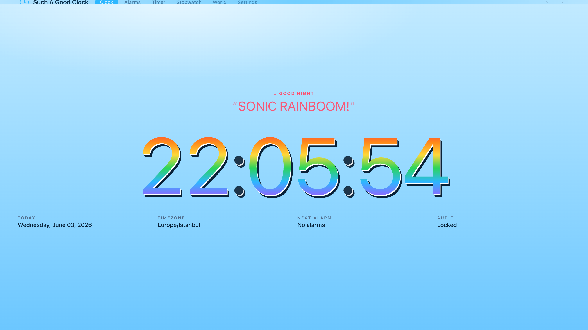

### Clock faces

Pick **Digital**, **Analog** (SVG hands), or **Flip** for any theme.

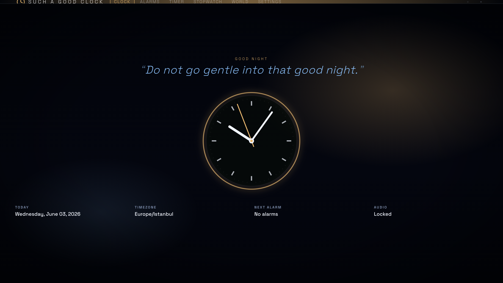

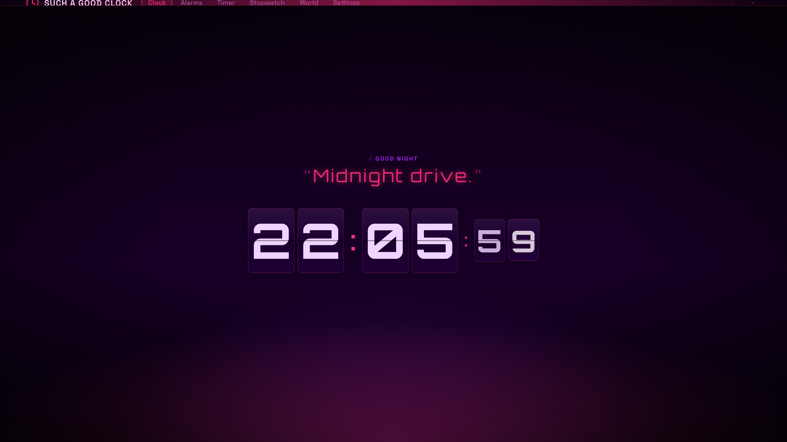

### Functional surfaces

#### Theme studio
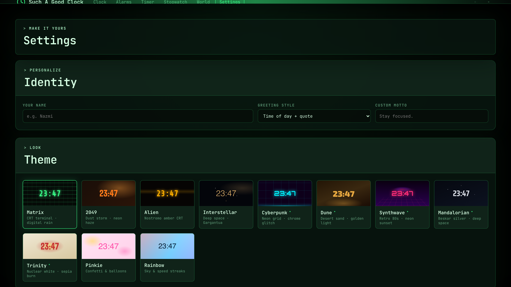

#### Timer & Pomodoro
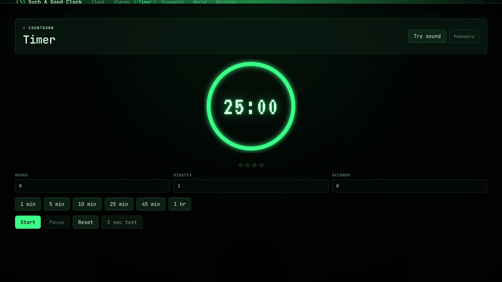

#### Stopwatch
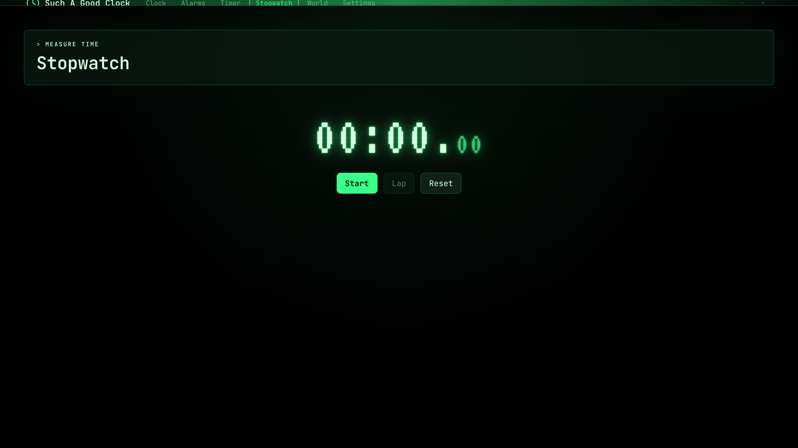

#### World Clock
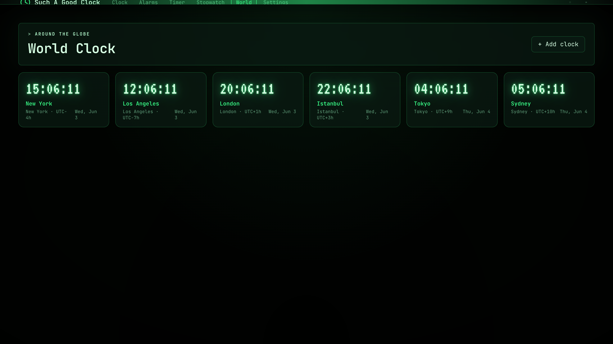

#### Alarms
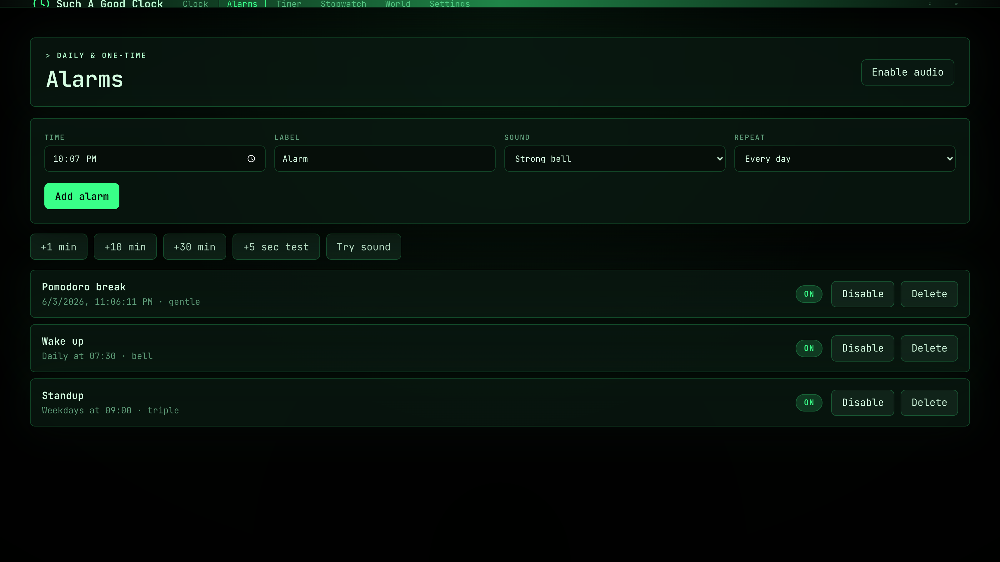

Such A Good Clock opens directly into a polished Matrix-inspired clock by default: split layout, live seconds, steady colon, full-volume Web Audio, auto-hiding top tabs, animated background effects, and CRT scanlines. From there, switch between eleven cinematic themes, choose a digital, analog, or flip face, tune the clock with a three-color palette, set alarms, run countdown timers or a Pomodoro cycle, time things with the stopwatch, track multiple timezones, and layer in ambient sound — in the browser or as a native desktop app.

## Features

- Three clock faces — **digital**, **analog** (SVG hands), and **flip** — switchable per theme.
- Clock, Alarms, Timer, Stopwatch, World, and Settings pages.
- Eleven visual themes: Matrix, 2049, Alien, Interstellar, Cyberpunk, Dune, Synthwave, Mandalorian, Trinity (Oppenheimer), Pinkie, and Rainbow.
- Theme cards with live previews and cinematic animated backgrounds.
- Three layouts (split, stack, minimal), four font scales (S/M/L/XL), accent swatches, and a custom three-stop clock color palette (top, middle, bottom).
- Display toggles: 12/24-hour, show seconds, blinking colon, and four date formats (long / short / ISO / hidden).
- Animated background effects, CRT scanlines, optional film-grain overlay, and an auto-hide top bar.
- Personal greeting controls: time-based greeting + quote, just-name, custom motto, or no greeting.
- Daily, weekday, weekend, and one-time alarms, plus quick +1 min / +10 min / +30 min and +5 second test buttons; the alarm popup follows you across pages with stop and 5-minute snooze.
- Countdown timer with a circular progress ring, hour/minute/second inputs, presets, and a 3-second test flow.
- **Pomodoro mode**: configurable work, short-break, long-break, and rounds, with session dots and auto-advancing phases.
- **Stopwatch** with hundredths precision, laps that highlight best and worst splits, and one-click **CSV export** of laps.
- **World clock**: add any IANA timezone with an optional label and watch the time update live across a grid.
- Six Web Audio alert sounds (Strong bell, Soft pulse, Triple chime, Digital beep, Cosmic tone, Gentle rise) with volume, mute, and per-alarm/per-timer defaults.
- **Ambient soundscapes**: Rain, Space, Fan, Café, or Forest, with an independent ambient volume.
- **Keyboard shortcuts** and a one-tap fullscreen toggle.
-localStorage persistence for alarms, world clocks, Pomodoro config, and all settings.
- Installable app shortcut support through a web app manifest and service worker.
- Modern modular ES6 architecture compiled and bundled with **Vite** for optimum performance.

## Keyboard shortcuts

| Key | Action |
| --- | --- |
| `Space` | Start / pause timer or stopwatch |
| `R` | Reset timer or stopwatch |
| `L` | Lap (stopwatch) |
| `F` | Toggle fullscreen |
| `1`–`6` | Switch tabs (Clock, Alarms, Timer, Stopwatch, World, Settings) |
| `←` / `→` | Previous / next theme |
| `Esc` | Stop ring / close dialog |
| `?` | Show the shortcuts panel |

## Open

Use the live app:

```text
https://nazmiefearmutcu.github.io/such-a-good-clock/
```

On supported desktop and mobile browsers, use the browser's install option to add Such A Good Clock as an app shortcut.

## Native Apps

The repository includes an Electron desktop shell that packages the same Such A Good Clock web app as a native desktop application.

Open the installed macOS app:

```bash
open "/Applications/Such A Good Clock.app"
```

Run the native app locally:

```bash
npm run desktop:run
```

Build desktop packages:

```bash
npm run desktop:build:mac
npm run desktop:build:win
npm run desktop:build:linux
```

Each build writes installers or archives to `dist-native/`. The GitHub Actions workflow builds macOS, Windows, and Linux artifacts on their matching runners and attaches them to tagged releases.

## Run

Run the local development server:

```bash
npm run dev
```

Then open the output address (usually `http://localhost:5173`).

To build the static production files and preview them:

```bash
npm run build
npm run serve
```

## Test

```bash
npm install
npm run test:e2e
```

The automated end-to-end smoke test builds the project using Vite, boots the app, verifies the live digital clock renders and ticks, checks corrupt-storage recovery, validates the PWA manifest and offline service-worker load, and confirms an alarm and a timer both fire Web Audio events. 

The test scenarios are modularized into independent test modules under `scripts/tests/` and screenshots are saved to `dist/test-results/such-a-good-clock-e2e.png`.

Current manual and automated coverage is tracked in `TEST_PLAN.md`.

